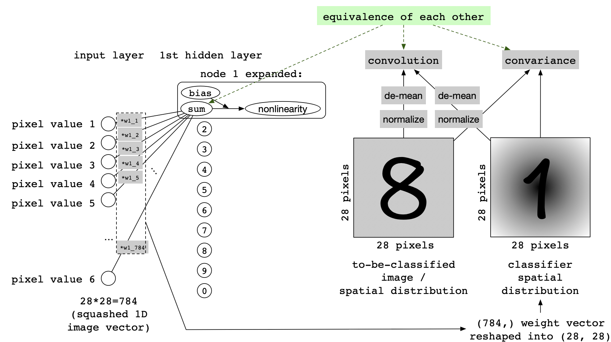

<!-- $theme: default -->

# CNN vs. FCN on Image Classification

Zhihan Yang, 19 Feb 2019

---
# Contents

- Introducing the MNIST
- Classifying the MNIST using a basic FCN
- Classifying the MNIST using a basic CNN
- Comparison between performances
- Comparison between architectures

---
## The purpose of this presentation

This presentation is about
1. getting us familiar with the MNIST and
2. giving us a better understanding on why CNNs are more suited for vision tasks than FCNs in general.

---
## <1>: Introducing the MNIST

- Number of train images: 60000
- Number of test images: 10000
- Shape of each image: square
- Height and width are both: 28 pixels (small)
- Number of channels: 1 (small)
	- Grayscale: 0 (black) to 255 (white) inclusive
- Current accuracy benchmark: 99.77% 
	- CNN + elastic distortion + width normalization (Ciresan, 2012)

---
## <1.1> Some good examples from the MNIST

---
## <1.2> Some (very, very) bad examples from the MNIST

Even humans cannot recognize these digits above. Therefore, it is possible that the current benchmark has over-fitted the data, but this is beyond the scope of this discussion.

---
## <2>: Classifying the MNIST using a simple FCN

Sub-sections:
1. FCN on MNIST: A peek at its architecture
2. FCN on MNIST: Looking at Keras implementation
3. FCN on MNIST: Performance

---
## <2.1> FCN: A peek at its architecture

- First layer: 
	- Number of neurons: 118
	- Activation: relu
	- Input shape: 28 * 28 = 784 (image are flattened to 1d vector) 
	- Trainable: True (weights can be optimized)
- Second layer:
    - Number of neurons: 10
    - Activation: softmax (converts real numbers to probabilities)
    - Trainable: True (weights can be optimized)
- Total trainable parameters: 93820 (weights + biases)

---
## <2.2> FCN: Keras implementation

- Data pre-processing
	- Fetch data using `keras.datasets.load("mnist")`
	- Reshape data `<array>.shape(28, 28, 1)`
	- Normalize data `<array>.astype("float32")/255` 
- Model training using the train set
	- Batch size: 128 
	- Epoch: 5
	- Choices of cost function, optimizer and metric are all parameters to `model.fit()`, which is very convenient
- Model evaluation using the test set

---
## <2.3> FCN: Performance

- Accuracy on train set: 97.73%
- Accuracy on test set: 97.18% (2% from the benchmark)

---
## <3>: Classifying the MNIST dataset using a simple CNN

Sub-sections:
1. CNN: A peak at its architecture
2. CNN: Keras implementation
3. CNN: Performance

---
## <3.1> CNN: A peak at its architecture

2 key takeaways: 
- alternating Conv2d and max_pooling layers
- the number of trainable parameters are similar to FCN

---
## <3.2> CNN: Keras implementation (similar to FCN's)

- Data pre-processing
	- Fetch data
	- Reshape data
	- Normalize data
- Model training using the train set
	- Batch size: 64
	- Epoch: 5 
	- Choices of cost function, optimizer and metric are all parameters to `model.fit()`, which is very convenient
- Model evaluation using the test set

---
## <3.3> CNN: Performance

- Accuracy on the train set: 99.40%
- Accuracy on the test set: 99.07% (1% from the benchmark)

---
## <4> Comparison between performances

- The basic CNN (99.07% accuracy), although having roughly the same number of trainable parameters, perform better than the basic FCN (97.18% accuracy) on the MNIST. 
- The current benchmark has 99.77% accuracy.

---
## <5> Why CNN works better?

Two more interesting yet seemingly contradictory questions to ask are:
1. why does the FCN works, 
2. but not as well as the CNN?

---
## <5.1> First question: why does the FCN work?

 

This FCN has only 10 nodes, but it looks very chaotic, and therefore FCNs are usually considered uninterpretable. However, notice in the next slide how the equation for summing is similar to the formula of covariance (a score that measures the similarity between two distributions). We will later see that the two formulas are equivalent.

---

 
 
 

---
## <5.1.1> Hypothesis

- We can interpret the weights connected to each node as a classifer distribution, and the image as a to-be-classified distribution. 
- Multiplying the weights and the flattened image in a element-wise manner and then summing the products enable the network to measure the similarity between the classifier distribution and the to-be-classified distribution.
- In fact, the above process is equivalent to applying a convolution operation to the whole image.

---

 

---
## Experiment to validate hypothesis

To construct intuitive kernels, I indexed through the training set and overlapped digits with the same labels. There is one resulting archetype for each class. These archetyped are then normalized and demeaned. Here is the archetypical "1" after 100, 500 and 1000 "1"s overlapped.

 
 
 

---

- Each archetype is an image-size kernel, which, together with a image, participate in a convolution operation - the sum of the element-wise product between the image and the kernel. As discussed previously, this convolution operation is equivalent (1) to covariance and (2) to the sum of the product between each pair of pixel value and weight. 

- The archetypes are flattened into weights of the first hidden layer. The set of weights representing each archetype is connected to one specific node. After an image passes through the first hidden layer, its predicted label is computed by applying argmax to the outputs of the 10 nodes.

- The accuracy on the test set is about 63%.

---
## Further exploration

A second hidden layer with 10 nodes are added to the FCN discussed in just now. The new architecture is trained on the training set with the first layer freezed. The new accuracy on the test set is about 81%. This tells us that the network can know more about a feature not only by knowing which kernel(s) the feature is similar to, but also by knowing which kernel(s) the feature is not so similar to.

---
## Second question: why does FCN perform worse than CNN?

FCN: directly measuring the similarity between image and kernel
CNN: construct *flexible* (using max-pooling) spatial hierachies from *local features* (using local convolutions with smaller kernels)

---
## References
1. Deep learning for computer vision (Chapter 5), Deep Learning with Python, by Francis Chollet, 2018
2. Current accuracy benchmark: 
	- Record of progress: http://yann.lecun.com/exdb/mnist/
	- Highest accuracy: https://arxiv.org/pdf/1202.2745.pdf

    